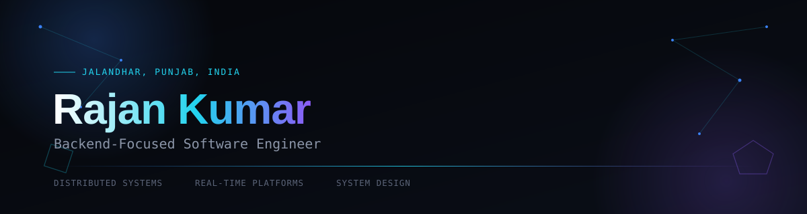

Building scalable backend systems, distributed applications, and real-time platforms —
 focused on reliable, fault-tolerant, high-performance software with clean architecture.

 

## System-minded, backend-first

Backend-focused engineer working on distributed systems, real-time platforms, and system design. Recent work spans event-driven messaging infrastructure and concurrency-safe transactional systems, built with an emphasis on reliability and performance under load.

&nbsp;&nbsp;`▹` Currently building **Daemon** and **MediSlot**
&nbsp;&nbsp;`▹` Learning deeper distributed systems patterns — consistency models, circuit breakers, consensus
&nbsp;&nbsp;`▹` Open to collaborating on backend infrastructure and real-time platforms
&nbsp;&nbsp;`▹` Ask me about REST API design, event-driven architecture, Redis, and WebSockets

 

## The toolkit

<b style="color:#22d3ee">System Design & Distributed Systems</b>

 

 

## Systems built from scratch

<table>
<tr>
<td width="50%" valign="top">

### Daemon
Real-time messaging platform · 5,000+ concurrent WebSocket connections

   

**[GitHub →](https://github.com/rajankumar2511/Daemon)** &nbsp;·&nbsp; **[Live Demo →](https://daemon-frontend-one.vercel.app/)**

View details

 

`→` Event-driven Socket.IO architecture on Redis Pub/Sub, supporting 5,000 concurrent authenticated connections in local load testing
`→` BullMQ workers with retry policies, exponential backoff, and dead-letter handling
`→` Distributed presence system: online/offline sync, last-seen tracking, full message lifecycle (Sent → Delivered → Seen)
`→` WebRTC peer-to-peer calling with Socket.IO signaling and Cloudinary media sharing
`→` Benchmarked at 107k events/sec across 100k+ processed events

</td>
<td width="50%" valign="top">

### MediSlot
Doctor appointment platform · Concurrency-safe booking

   

**[GitHub →](https://github.com/rajankumar2511/Med)** &nbsp;·&nbsp; **[Live Demo →](https://med-kappa-five.vercel.app/)**

View details

 

`→` Concurrency-safe booking via serializable PostgreSQL transactions, Redis idempotency, and distributed locking
`→` CQRS + Transactional Outbox pattern powering an event-driven notification pipeline with a Postgres-backed DLQ
`→` Cut API latency 79ms → 47ms (40%) and raised throughput 1,124 → 2,095 req/sec (86%) at 100 concurrent users
`→` HMAC-verified payment workflow, atomic across payment, confirmation, and outbox events
`→` LLM-assisted symptom triage for intelligent doctor discovery

</td>
</tr>
</table>

 

## GitHub stats

 

## Foundations

**Dr. B.R. Ambedkar National Institute of Technology, Jalandhar**
B.Tech in Electronics and Communication Engineering (ECE) · 2023 – 2027

`▹` Relevant Coursework: Data Structures & Algorithms, DBMS, Machine Learning, NLP, Python Programming
`▹` Solved 250+ Data Structures & Algorithms problems across coding platforms

 

## Let's build something reliable

 

Rajan Kumar — backend-focused software engineer

